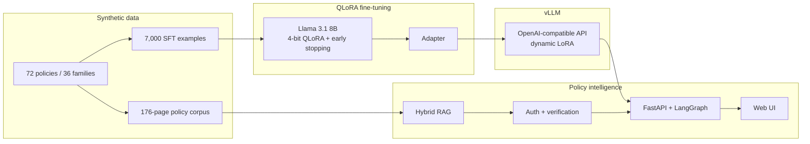

# TakaSecure — Secure Banking Policy Intelligence

  

An end-to-end generative AI engineering project: QLoRA fine-tuning, self-hosted vLLM serving,
adaptive hybrid RAG, and a full security/verification layer, built to answer bank employees'
policy questions without sending confidential context to a third-party model API.

> **Portfolio demo.** All institutions, policies, cases, identifiers, thresholds, and documents
> are synthetic. Not banking, legal, regulatory, credit, fraud, or security advice.

**[▶ Watch the demo](https://www.loom.com/share/fbcc349553004b5194132c54ceba0963)** · **[Full technical report](docs/TECHNICAL_REPORT.md)**

## The problem

Bank employees need fast answers from large policy collections, but the documents, prompts, and
retrieved passages may be confidential — ruling out a third-party hosted LLM API. A generic
chatbot on top of that data can also hallucinate thresholds, cite superseded policies, follow
instructions hidden in a document, or cross role boundaries. TakaSecure combines fine-tuning
(behavior), RAG (current knowledge), and self-hosted vLLM (an inference boundary the deployer
controls) to address both problems together.

## The interesting part: diagnosing memorization, not just training a model

The QLoRA fine-tune (Llama 3.1 8B, Unsloth, response-only loss) showed a classic overfitting
signature: training loss kept falling while validation loss turned upward after step 100.

| Step | Train loss | Val loss |
|---|---|---|
| 50 | 0.273 | 0.439 |
| 100 | 0.038 | **0.357** ← best |
| 150 | 0.010 | 0.406 |
| 200 | 0.011 | 0.471 |

The model was fitting the exact phrasing patterns of the training set rather than the underlying
citation/grounding behavior — enabled by too little template diversity in the synthetic
question/answer generation. The fix was threefold: expand phrasing diversity per task type so the
same reasoning shows up in different surface forms, early-stop on validation loss, and restore the
best checkpoint instead of the final one. That checkpoint is what's evaluated below. Full
diagnosis and training config in the [technical report](docs/TECHNICAL_REPORT.md#fine-tuning).

## Architecture



Full request-level flow — authorization, retrieval routing, corrective retrieval, verification,
caching — is in the [technical report](docs/TECHNICAL_REPORT.md#architecture).

## Results

| Held-out SFT metric (100 examples) | Result |
|---|---|
| Citation recall / precision | 1.000 / 1.000 |
| JSON validity | 1.000 |
| Tool-name / tool-input accuracy | 0.944 / 1.000 |

| RAG smoke evaluation (1 case, RAGAS 0.4.3) | Result |
|---|---|
| Grounded, verified, citation recall/precision | 1.000 |
| RAGAS faithfulness / context recall | 1.000 / 1.000 |
| RAGAS context precision | 0.909 |

The 50-case golden set exists and is scripted; the retained RAGAS number above is an integration
smoke test, not yet a full statistically meaningful run — see
[limitations](docs/TECHNICAL_REPORT.md#limitations-and-roadmap) for why, and what's next.

## What it does

| Feature | What it does |
|---|---|
| Role/department authorization | Denies unauthorized scopes before evidence is retrieved, not after. |
| Adaptive hybrid retrieval | BGE-M3 dense + BM25 sparse in Qdrant, with model-chosen direct vs. multi-query routing. |
| Corrective RAG | Grades evidence sufficiency and retries once before abstaining. |
| Grounded, cited answers | Answers only from authorized evidence with traceable policy IDs. |
| Injection resistance | Treats retrieved documents as untrusted data, never as instructions. |
| Fail-closed verification | A separate verifier plus deterministic citation/tool checks run before publication. |
| Approved tool routing | Structured tool calls checked against catalog-approved metadata. |
| Verified exact-match caching | Optional SHA-256-keyed cache of only verified responses. |

Full feature list in the [technical report](docs/TECHNICAL_REPORT.md#chatbot-features).

## Quick start

```bash
git clone https://github.com/Shoaib-33/TakaSecure-AI-based-Secure-Banking.git
cd TakaSecure-AI-based-Secure-Banking
python -m venv bank_venv && source bank_venv/bin/activate
pip install -e ".[dev,eval]"
cp .env.example .env   # then fill in your vLLM endpoint/key
uvicorn takasecure_rag.main:app --host 0.0.0.0 --port 8080
```

Requires a running vLLM endpoint serving the base model + `takasecure` LoRA adapter. Full RunPod
provisioning, model download, and vLLM launch steps (including the CUDA-version gotcha) are in the
[complete setup guide](docs/TECHNICAL_REPORT.md#complete-setup).

## Repository structure

```
.
|-- takasecure_rag/   FastAPI, LangGraph, retrieval, auth, cache
|-- frontend/         web UI
|-- notebooks/        RunPod fine-tuning notebook
|-- scripts/          data generators and RAGAS runner
|-- data/             SFT splits, policy catalog, RAG corpus
|-- evaluation/       RAGAS and golden-set artifacts
|-- docs/             technical report and operating notes
+-- tests/            regression tests
```

## Limitations

Portfolio-scale, not production-ready: synthetic data only, the in-memory vector index rebuilds
per process, RunPod uses a public proxy instead of private networking, and the RAGAS judge is
same-family/same-deployment rather than independent. Full list and roadmap in the
[technical report](docs/TECHNICAL_REPORT.md#limitations-and-roadmap).

## License

[MIT](LICENSE)
